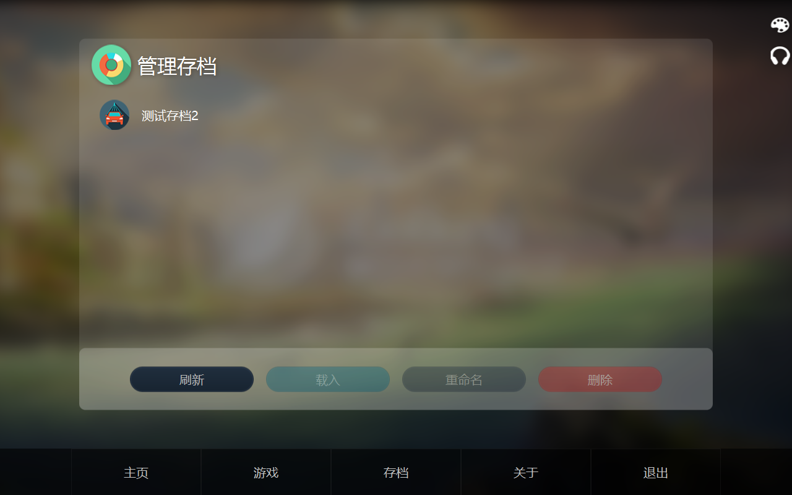
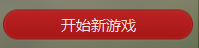
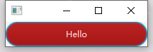
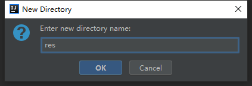
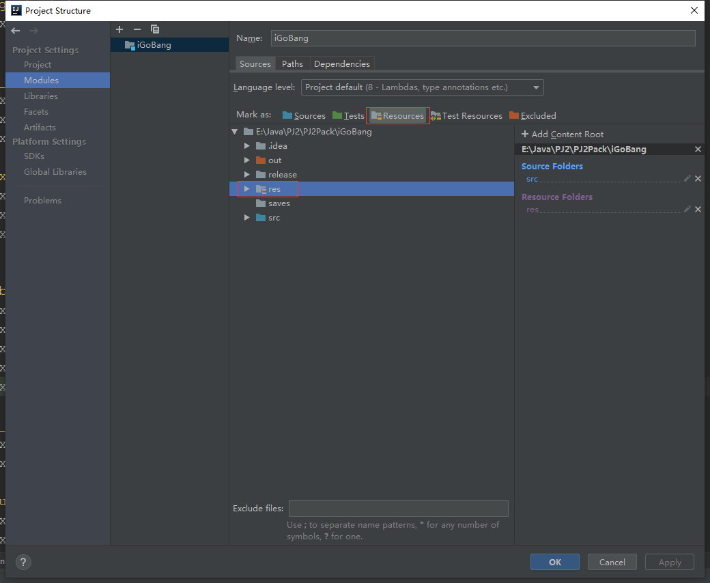
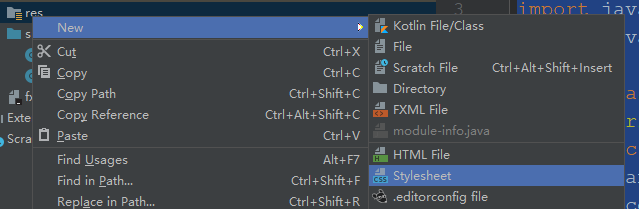
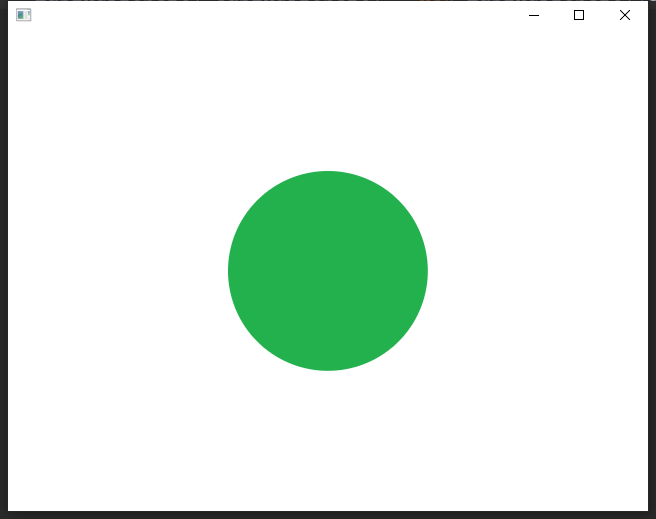
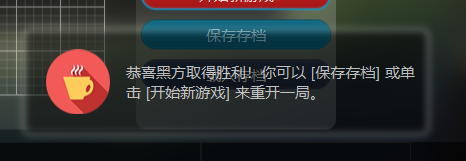
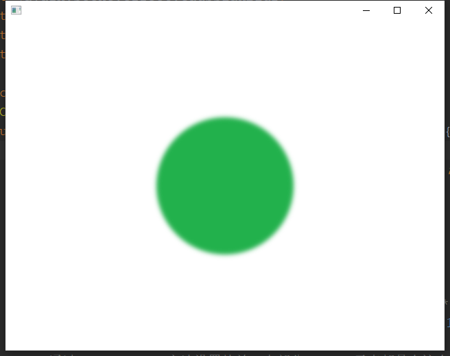
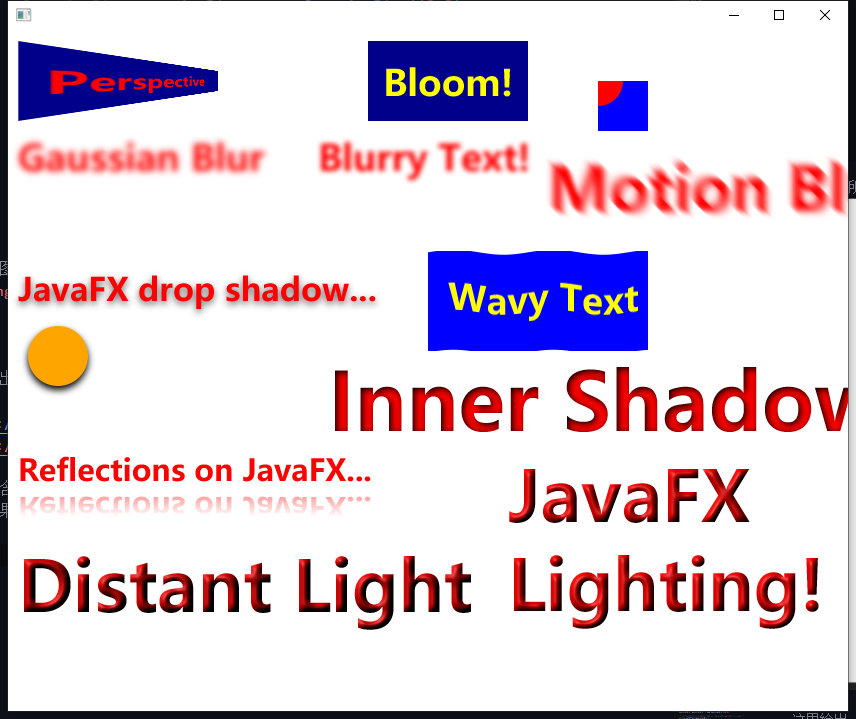

# 浅析 Java 开发案例——iGoBang





# 界面元素

在看到这个开发案例的界面时时，一定会有很多人想问这个问题：按照教科书上的JavaFX代码来编写程序，其界面都是千篇一律的白色风格，如何像这个案例一样设计出种类多样、色彩丰富的界面元素呢？

通过了解以下拓展知识，你也可以设计一套属于自己风格的界面


## JavaFX CSS
JavaFX为开发者提供了一套层叠样式表语言（JavaFX CSS，以下简称FXSS），即通过将不同样式属性（背景图片、文字颜色等）的属性值写到一个文件中，再由JavaFX载入生效从而改变默认的界面样式。其语法与Web开发中的的CSS类似，想要了解CSS语言的同学，可以参考这个链接：

[CSS入门教程（W3School）](http://www.w3school.com.cn/css/css_reference.asp)


建议之前没有了解过CSS的同学**粗略过一遍**上面的教程。

与CSS不同的是，FXSS的语法略显不同，这种差异性主要体现在样式属性名上：FXSS的属性名全部带有```-fx-```前缀以和CSS区分。理论总是枯燥的，下面以几个界面元素为例，简述如何对界面上的按钮应用不同的风格：




# 样例：红色按钮（通过内嵌FXSS样式到Java代码中）

(对于下列代码中用到的FXSS属性，同学们只需了解即可，稍后会贴上完整的FXSS属性参考文档)

## 创建红色按钮类并继承JavaFX默认的按钮

```Java
import javafx.scene.control.Button;
/**
 * 红色的按钮
 */

public class RedButton extends Button {

    public RedButton(String title) {
        super(title);

        this.setStyle(this.getStyle() + "-fx-base:#b71a1a;");
        /* -fx-base 代表背景颜色，#b71a1a是一种红色的颜色码
         * 可以利用这个工具创建自己的颜色码：http://atool.org/colorpicker.php */


        this.setStyle(this.getStyle() + "-fx-text-fill:#ffdfdf;");
        // -fx-text-fill 代表文本颜色，#b71a1a是一种白灰色的颜色码

        this.setStyle(this.getStyle() + "-fx-font-size:12;");
        // -fx-text-fill 代表文本字号

        this.setStyle(this.getStyle() + "-fx-pref-width:200;");
        // -fx-text-fill 代表按钮偏好大小，相当于JavaFX中的setPrefSize()方法

        this.setStyle(this.getStyle() + "-fx-background-radius:2em;");
        // -fx-background-radius 代表圆角半径，使按钮边角变得更加圆润，em是相对大小单位

        this.setStyle(this.getStyle() + "-fx-padding: 10px;");
        // -fx-padding 代表四周留白空间，px是尺寸单位（像素）


    }
}

```


## 创建一个简单的程序来使用这个按钮

```Java
import javafx.application.Application;
import javafx.scene.Scene;
import javafx.scene.layout.Pane;
import javafx.stage.Stage;

public class Main extends Application {
    @Override
    public void start(Stage primaryStage) throws Exception {
        Pane pane = new Pane();

        RedButton redButton = new RedButton("Hello");
        // 创建并使用红色按钮对象

        pane.getChildren().addAll(redButton);
        Scene scene = new Scene(pane);
        primaryStage.setScene(scene);
        primaryStage.show();
    }
}

```


效果如图所示：




# 将FXSS代码写入到文件中

之前的样例中虽然通过在Java代码中写入样式来实现红色按钮的效果，但是这样的代码并不优雅，因为在实际的开发中往往需要嵌入大量的样式属性而不是像本文中的例子一样仅仅是几行代码就能解决

因此，将样式写入到一个文件中，打开程序时动态加载是一个更好的选择。下面我们就来动手创建一个这样的工程

## 建立样式文件

在工程目录新建资源目录，并命名为res




在```File——Project Structure```中将res目录设置为资源路径



这样一来，在res目录中建立的样式文件都可以被Java加载，现在在res文件中创建新的样式文件



在里面写上如下代码：

```CSS
.red-button{
    /* 此处的red-button代表一个类名，在Java代码中为界面元素加入这个类名即可应用此处的所有样式 */

    -fx-font-size:12;
    -fx-pref-width:200;
    -fx-background-radius: 2em;
    -fx-base:#b71a1a;
    -fx-text-fill:#ffdfdf;
    -fx-padding: 10px;
}
```


这样以来，RedButton类就可以改成下面这种形式：

```Java
import javafx.scene.control.Button;
/**
 * 红色的按钮
 */

public class RedButton extends Button {

    public RedButton(String title) {
        super(title);

        this.getStyleClass().add("red-button");
        // 将按钮与CSS文件中的red-button类名绑定
    }
}

```


同时，在程序运行时载入写好的CSS资源文件：

```Java
import javafx.application.Application;
import javafx.scene.Scene;
import javafx.scene.layout.Pane;
import javafx.stage.Stage;

public class Main extends Application {
    @Override
    public void start(Stage primaryStage) throws Exception {
        Pane pane = new Pane();
        Scene scene = new Scene(pane);

        scene.getStylesheets().add(Main.class.getResource("red-button.css").toString());
        // 载入资源文件的固定格式

        RedButton redButton = new RedButton("Hello");
        pane.getChildren().addAll(redButton);
        primaryStage.setScene(scene);
        primaryStage.show();
    }
}

```


这样一来，Java代码的简洁性就提高了很多，这么做的好处是显而易见的：

+ 可以将不同界面元素与同一个CSS文件中的不同类名绑定，实现样式的统一管理

+ 修改样式无需在大量的Java样式中翻找，修改css文件即可

+ 可以通过加载不同的css文件实现整体样式变换


对FXSS有更深一步了解需求的同学，可以参考下面的教程：

+ [JavaFX CSS简单使用教程1](https://www.yiibai.com/javafx/css-style.html)

+ [JavaFX CSS简单使用教程2](https://blog.csdn.net/zavens/article/details/43560797)

+ [JavaFX CSS官方参考代码（包含所有的样式属性）](https://docs.oracle.com/javafx/2/api/javafx/scene/doc-files/cssref.html)

+ 本案例中的的res/stylesheet


# 动画

相信很多人都会觉得，动画是这个案例中最引人注目的一点。这些动画看起来复杂，实际上只要理解这些动画的本质，实现起来非常简单

就像~~人类的本质是复读机~~一样，**动画**的本质就是属性随着时间变动。比如透明度随时间降低，就是渐隐动画；尺寸随动画变大，就是缩放动画。倘若属性随时间变化越来越慢（如尺寸的变大逐渐减慢）则就是案例中的缓动动画。下面就按照这个原理解释动画的实现

**注意：要理解下列实现过程，请先保证自学完教科书第15章的Timeline部分**


## 属性
JavaFX将很多属性都包装成了对象，比如：
```Java
button.prefWidthProperty();
// 按钮的宽度属性

button.opacityProperty();
// 按钮的透明度属性
```

这些属性对象（必须是非只读）可以被重新赋值，从而在界面上体现出来。那么如果能实现随着时间的推移连续地对这些属性赋值，就可以构成动画。这就需要用到JavaFX中的```Timeline```类


## 对 Timeline 的包装

下列代码编写一个缓动动画类（EasingProperty），它接受一个属性对象，并支持以动画的方式改变该属性的值。```无需担心代码过长难以理解，代码中的注释已经提供了充分的解释```，同学们只需先按步骤试着将代码拷贝到一个测试工程中，逐步理解每一行代码代表的操作，就可以用该动画类实现很多操作了


```Java
import javafx.animation.Animation;
import javafx.animation.KeyFrame;
import javafx.animation.Timeline;
import javafx.beans.property.DoubleProperty;
import javafx.event.ActionEvent;
import javafx.event.EventHandler;
import javafx.scene.effect.GaussianBlur;
import javafx.util.Duration;

/**
 * 属性缓动类
 */

public class EasingProperty {
    private static final Duration animationDuration = Duration.millis(15);
    private static final double minUnit = 0.001;
    private static final double absoluteMinUnit = 1e-10;

    private double fromValue;
    private double toValue;
    private DoubleProperty property;
    private double currentValue;
    private Timeline tl;

    /**
     * 构造函数
     * @param valueProcessed 要操作的属性对象
     */
    EasingProperty(DoubleProperty valueProcessed) {
        this.property = valueProcessed;

        /* 属性初始值 */
        this.fromValue = property.getValue();

        /* 属性目标值（触发动画时用户通过调用setToValue()来设定） */
        this.toValue = this.fromValue;

        /* 属性当前值，介于属性初始值和属性目标值之间，随着动画的播放而逐步向目标值靠近。越接近属性目标值则代表动画越趋近于结束 */
        this.currentValue = this.fromValue;


        /* 创建每帧事件，即Timeline每隔一段时间要执行的操作*/
        KeyFrame keyFrame = new KeyFrame(animationDuration, new KeyFrameHandler());

        /* 初始化Timeline对象（默认停止）*/
        tl = new Timeline(keyFrame);
        tl.setCycleCount(Animation.INDEFINITE);
        tl.stop();
    }

    /**
     * 设置动画的目标值，构造函数中创建的keyFrame对象会自动根据fromValue，toValue，和 currentValue来动态地连续设置属性
     * @param value 目标值
     */
    void setToValue(double value) {
        /* 如果触发动画时上个动画还未完成，则停止上个动画 */
        if (getTimeline().getStatus() == Animation.Status.RUNNING)
            getTimeline().stop();

        /* 如果目标值和当前值相差不大，则不触发动画 */
        if (Math.abs(value - property.getValue()) < absoluteMinUnit) {
            return;
        }

        /* 设置初始值和目标值并开始动画 */
        this.toValue = value;
        this.fromValue = property.getValue();
        this.currentValue = fromValue;
        getTimeline().play();
    }

    /**
     * @return 取起始值和目标值的差距
     */
    private double getTotalDistance() {
        return (toValue - fromValue);
    }

    /**
     * @return 取当前值和目标值的差距
     */
    private double getDistance() {
        return (toValue - currentValue);
    }

    /**
     * @return 取动画的Timeline对象
     */
    private Timeline getTimeline() {
        return this.tl;
    }

    /**
     * 由于double不能直接用==来判断相等（精度问题），故设置一个小量minUnit，
     * 当|a - b| < minUnit时，认定a与b相等
     *
     * @param a 要比较的double值1
     * @param b 要比较的double值2
     * @return 若 a < b 返回-1，a > b返回1， a = b返回0
     */
    private int compareDouble(double a, double b) {
        if (Math.abs(a - b) < Math.abs(minUnit * getTotalDistance()))
            return 0;
        else if (a > b)
            return 1;
        else
            return -1;
    }

    /**
     * 获取当前动画速度，即每次keyFrame事件时属性值的增量
     * @return 速度
     */
    private double getCurrentSpeed() {
        /* 属性当前值和目标值的差距*/
        double distance = getDistance();

        /* 属性初始值和目标值的差距*/
        double totalDistance = getTotalDistance();

        /* 速度比例*/
        double rate = 0.15;

        /* 速度 = 当前值和目标值的差距 * 速度比例。 即差距越小，速度越慢 */
        return rate * distance;
    }

    protected class KeyFrameHandler implements EventHandler<ActionEvent> {
        @Override
        public void handle(ActionEvent e) {
            /* 若当前值等于目标值，则停止动画 */
            if (compareDouble(currentValue, toValue) == 0) {
                currentValue = toValue;
                property.setValue(toValue);
                getTimeline().stop();
                fromValue = toValue;
                return;
            }

            /* 计算增量并设置属性值 */
            currentValue += getCurrentSpeed();
            property.setValue(currentValue);
        }
    }
}

```


下面建立一个简单的程序来测试动画：

```Java
import javafx.application.Application;
import javafx.scene.Scene;
import javafx.scene.layout.StackPane;
import javafx.scene.shape.Circle;
import javafx.stage.Stage;

public class Main extends Application {
    @Override
    public void start(Stage primaryStage) throws Exception {
        StackPane pane = new StackPane();
        Scene scene = new Scene(pane, 640, 480);

        Circle circle = new Circle(30);

        /*将圆设置为绿色*/
        circle.setStyle("-fx-fill:rgb(34,177,76);");

        EasingProperty easingProperty = new EasingProperty(circle.radiusProperty());
        /* 将圆的半径属性设置为动画属性*/

        circle.setOnMouseClicked(e -> {
            if(circle.getRadius() > 30)
                /*设置半径目标值为30*/
                easingProperty.setToValue(30);
            else
                /*设置半径目标值为100*/
                easingProperty.setToValue(100);
        });

        pane.getChildren().addAll(circle);
        primaryStage.setScene(scene);
        primaryStage.show();
    }
}

```

运行效果如下，点击中间的圆形会产生缩放动画：




# 特效

细心观察的同学会发现，程序中出现了一些特效，比如模糊：




背景的模糊也是由模糊特效来实现的

实际上，特效是该教程中实现起来最简单的部分，应用特效的步骤只需要以下两步：

+ 创建特效对象

+ 设置特效对象

这里以上面的圆形为例，为圆形增加模糊特效：

```Java
import javafx.application.Application;
import javafx.scene.Scene;
import javafx.scene.effect.GaussianBlur;
import javafx.scene.layout.StackPane;
import javafx.scene.shape.Circle;
import javafx.stage.Stage;

public class Main extends Application {
    @Override
    public void start(Stage primaryStage) throws Exception {
        StackPane pane = new StackPane();
        Scene scene = new Scene(pane, 640, 480);

        Circle circle = new Circle(100);

        /*将圆设置为绿色*/
        circle.setStyle("-fx-fill:rgb(34,177,76);");

        /* 创建一个高斯模糊对象，关于高斯模糊的定义大家可以自行百度 */
        GaussianBlur gaussianBlur = new GaussianBlur(10.0);

        /* 通过setEffect()方法设置特效，大部分JavaFX元素都具有这个方法 */
        circle.setEffect(gaussianBlur);

        pane.getChildren().addAll(circle);
        primaryStage.setScene(scene);
        primaryStage.show();
    }
}
```

效果如图所示：



**注意：特效对象可以与前一部分的EasingProperty结合起来，从而产生动画特效（如动感模糊的模糊度属性与对象X、Y轴的坐标属性可以结合起来实现“残影移动”的效果，在这个方面同学们大可自己开动想象力）**

这里列举出常用的几个特效类名：

+ 发光特效(Bloom)

+ 高斯模糊特效(GaussianBlur)

+ 动感模糊特效(MotionBlur)

+ 内阴影特效(InnerShadow)

+ 光照特效(Lighting)

+ 透视特效(Perspective)


若要了解JavaFX的更多特效，可以参照以下链接：

[http://www.javafxchina.net/blog/docs/tutorial8-transformation-animation-effect/](http://www.javafxchina.net/blog/docs/tutorial8-transformation-animation-effect/)

里面包含了JavaFX的所有特效对象，同学们只需要下载其中的visual_effect.zip例程并运行即可。效果如图所示：





# 善用搜索引擎

搜索引擎是信息的一大来源，我在开发这个案例时。完全没有任何一个完整的教程来引导我开发出这样一个复杂的图形界面，所有的知识都是通过不断搜索相关资料一点一点积累起来的。现在我将当时收集到的所有知识与大家分享，也希望同学们将搜索引擎的作用发挥起来，就能在此教程的基础上进一步增加自己程序的炫酷程度。